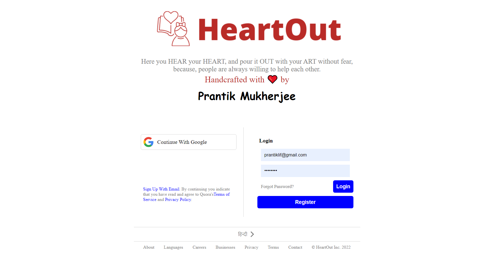
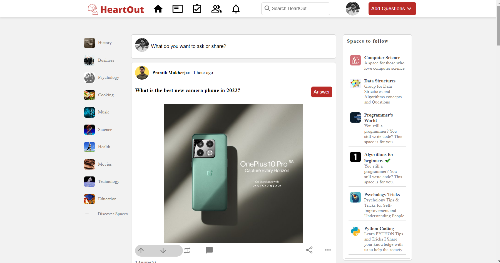
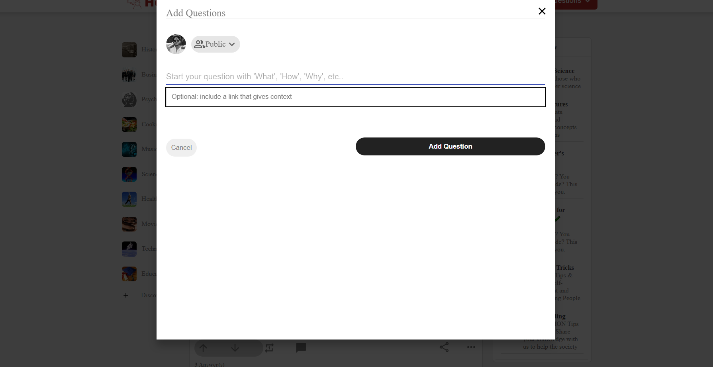
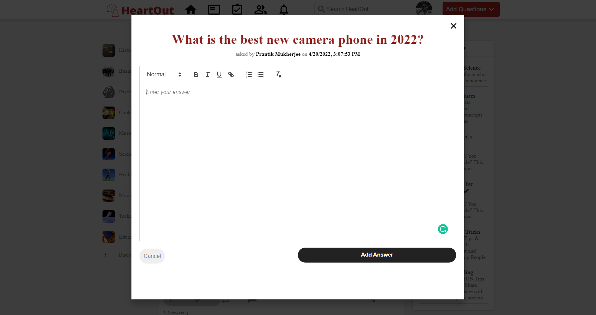

# HeartOut 
HERE you **HEAR** your **HEART**, and pour it **OUT** with your **ART** (questions, answers, writings, poetries, storytellings, drawings, paintings, creativity, crafts, etc,) without fear, because, people are always willing to help each other.

A Fully Responsive **Full Stack** Web Application built using **React.js, Node.js, Express.js, MongoDB & Firebase** 
- A Platform to ask questions and get quality answers with **Google Authentication** enabled.
- Getting **Real-Time** data with **Rest-API** integration along with **React Quill** as a smooth Rich Text Editor
# Signup/Login

# HomePage

# Adding Questions

# Adding Answers

